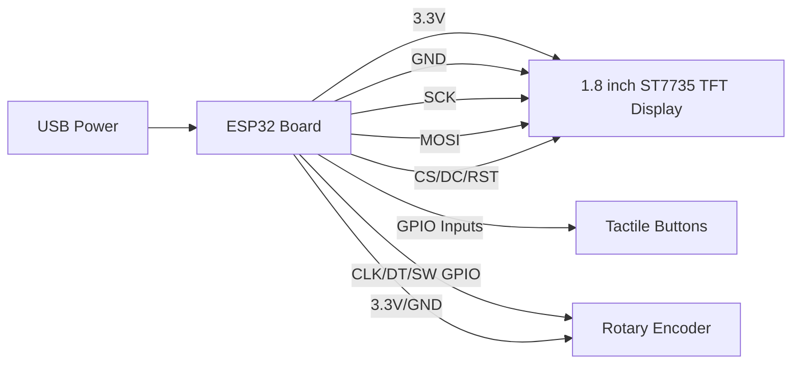

# Spotify Display

I am building a small desk display that shows what I am currently playing on Spotify. I wanted it to be something I could keep on my desk instead of always checking my phone or computer. I started from the Spotify display idea, but I am adding a rotary encoder so the project is not just a basic display. The encoder will be used as a physical volume knob, and pressing it can also work like a button for input.

This project uses an ESP32 because it has WiFi built in, which is needed to connect to Spotify's API. The screen is a 1.8 inch ST7735 TFT display connected over SPI. I designed the enclosure in Autodesk Fusion and made space for the display, buttons, encoder, and mounting hardware. A lot of the early work was figuring out CAD basics, especially making closed sketches, extruding correctly, and placing the screen cutout in the center instead of guessing.

## What I am adding

The main extra feature I am adding is a rotary encoder for volume control. Turning the knob will be used to change volume, and the push button on the encoder can be used for an extra control like play/pause or select. I added this because the first design was too close to the guide, and I wanted the display to feel more like a real desk gadget with physical controls.

## Parts / BOM

| Part | Purpose | Qty | Estimated Cost |
|---|---|---:|---:|
| ESP32 board | Main microcontroller and WiFi connection | 1 | $8.99 |
| 1.8 inch ST7735 TFT display | Shows Spotify track information | 1 | $9.95 |
| Tactile switches | Basic user controls | 1 pack | $4.49 |
| Rotary encoder | Volume knob / extra input | 1 | TBD |
| M3 heat-set inserts | Stronger mounting points for the case | 1 pack | $5.99 |

A separate `BOM.csv` file is also included in the repo.

## Wiring Diagram



## Current pin plan

| Component | Connection |
|---|---|
| TFT VCC | ESP32 3.3V |
| TFT GND | ESP32 GND |
| TFT SCK | ESP32 SPI SCK |
| TFT MOSI | ESP32 SPI MOSI |
| TFT CS / DC / RST | ESP32 GPIO pins |
| Buttons | ESP32 GPIO input pins |
| Rotary Encoder CLK / DT / SW | ESP32 GPIO input pins |

The exact GPIO numbers may change depending on the final ESP32 board layout and how the parts fit inside the case.

## Repo Organization

```text
/assets   - screenshots, diagrams, and project images
/CAD      - Fusion/STL files for the enclosure
/code     - firmware files
BOM.csv   - parts list
README.md - project explanation
```

## Files and design work

The enclosure was designed in Fusion. I adjusted the wall thickness, screen opening, and top panel so the display and controls would fit better. I also had to learn how to use measurements properly instead of just eyeballing placement. The case is meant to be 3D printed and assembled with heat-set inserts so it can be opened again if I need to fix wiring or adjust the electronics.

## Current status

Right now I have the CAD design started and the main parts list prepared. The next steps are to add the rotary encoder into the CAD, make sure the repo is organized into folders, and update the firmware so the ESP32 can read the encoder input and use it for volume control.
